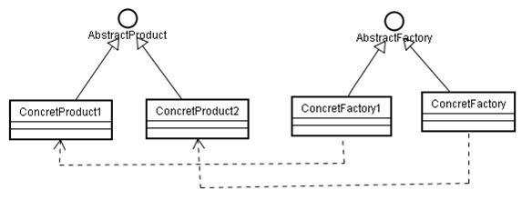
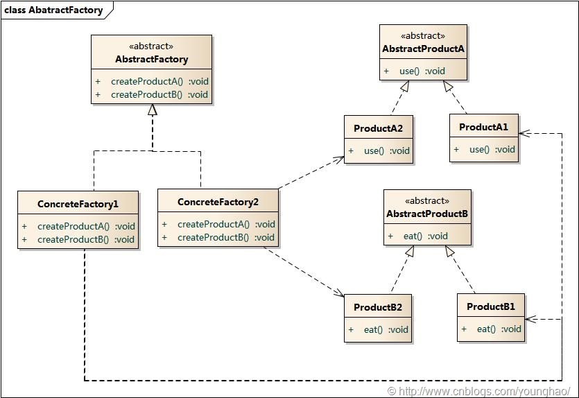
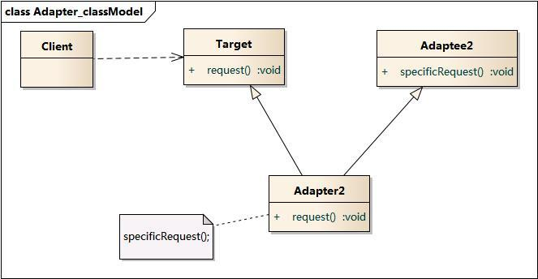
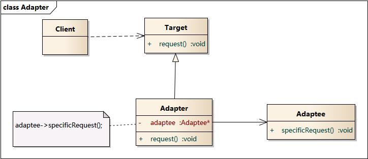
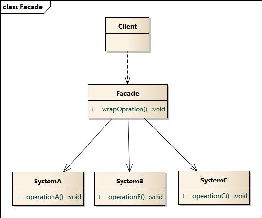
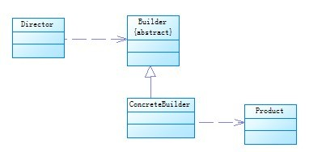
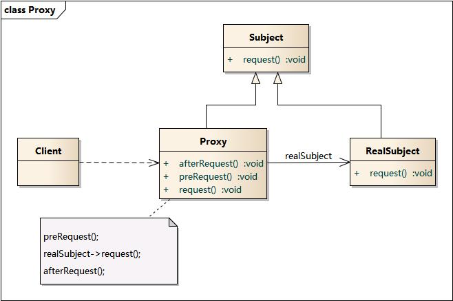
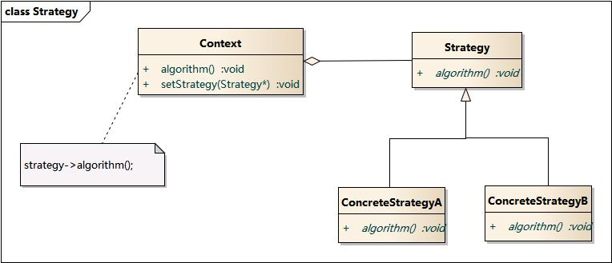
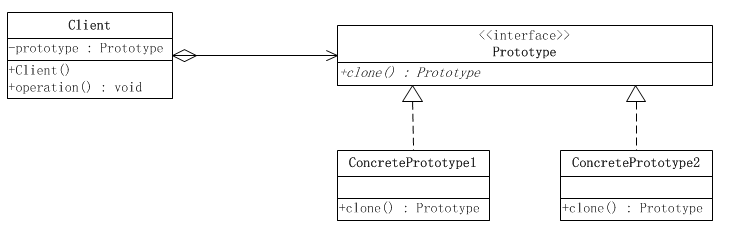

# designmode

## 工厂模式（Factory）

### 模式定义

包路径：`com.tzx.factory`

工厂方法模式定义一个用于创建对象的接口，让子类决定实例化哪一个类。工厂方法使一个类的实例化延迟到其子类。

>  **简单工厂模式**、**工厂模式**和**抽象工厂模式**，它们都属于创建型模式，其主要功能都是将对象的实例化部分抽取出来。简单工厂模式也称为静态工厂模式，包含三种角色：
>
>  - Factory工厂角色——负责实现创建所有实例的内部逻辑；
>  - Product抽象产品角色——创建的所有对象的父类，负责描述所有实例所共有的公共接口；
>  - ConcreteProduct具体产品角色——继承自Product，负责具体产品的创建。
>  - ConcreteFactory具体工厂类——继承自Factory，实现不同特性的工厂。

### 简单工厂模式


实例化对象的时候不再使用 new Object()形式，可以根据用户的选择条件来实例化相关的类。对于客户端来说，去除了具体的类的依赖。只需要给出具体实例的描述给工厂，工厂就会自动返回具体的实例对象。

这样的话，当子类的类名更换或者增加子类时我们都无需修改客户端代码，只需要在简单工厂类上增加一个分支判断代码即可。


- 优点：我们可以对创建的对象进行一些 “加工” ，而且客户端并不知道，因为工厂隐藏了这些细节。如果，没有工厂的话，那我们是不是就得自己在客户端上写这些代码，这就好比本来可以在工厂里生产的东西，拿来自己手工制作，不仅麻烦以后还不好维护。

- 缺点：如果需要在方法里写很多与对象创建有关的业务代码，而且需要的创建的对象还不少的话，我们要在这个简单工厂类里编写很多个方法，每个方法里都得写很多相应的业务代码，而每次增加子类或者删除子类对象的创建都需要打开这简单工厂类来进行修改。这会导致这个简单工厂类很庞大臃肿、耦合性高，而且增加、删除某个子类对象的创建都需要打开简单工厂类来进行修改代码也违反了开-闭原则。

#### 举例说明

用 `Retrofit` 进行举例：

```java
private static final Platform PLATFORM = findPlatform();
static Platform get() {
    return PLATFORM;
}
private static Platform findPlatform() {
    try {
        Class.forName("android.os.Build");
        if (Build.VERSION.SDK_INT != 0) {
            return new Android();
        }
    } catch (ClassNotFoundException ignored) {
    }
    try {
        Class.forName("java.util.Optional");
        return new Java8();
    } catch (ClassNotFoundException ignored) {
    }
    try {
        Class.forName("org.robovm.apple.foundation.NSObject");
        return new IOS();
    } catch (ClassNotFoundException ignored) {
    }
    return new Platform();
}
```

`findPlatform` 相当于一个**简单工厂** ，用来产生：

```java
static class Java8 extends Platform {}
static class Android extends Platform {}
static class IOS extends Platform {}
```

### 工厂模式

如果上面的**简单工厂**模式中，创建每一个 `Shape` 都需要大量的逻辑代码，而且 `Shape` 的类型还不少。那么这个时候我们维护这个 `Factroy` 就比较费力了。



抽象产品类派生出多个具体产品类；

抽象工厂类派生出多个具体工厂类；

每个具体工厂类只能创建一个具体产品类的实例;

即定义一个创建对象的接口（即抽象工厂类），让其子类（具体工厂类）决定实例化哪一个类（具体产品类）。“一对一”的关系。

#### 举例说明

我们继续用 `Retrofit` 中的例子做参考，如果使用**简单工厂**构造 `CallAdapter` ，那么这个工厂类将维护多个复杂的逻辑。

```java
public interface CallAdapter<T> {
    Type responseType();
    <R> T adapt(Call<R> call);
    abstract class Factory {
        public abstract CallAdapter<?> get(Type returnType, Annotation[] annotations, Retrofit retrofit);
        protected static Type getParameterUpperBound(int index, ParameterizedType type) {
            return Utils.getParameterUpperBound(index, type);
        }
        protected static Class<?> getRawType(Type type) {
            return Utils.getRawType(type);
        }
    }
}
```

- CallAdapter作为抽象产品
- CallAdapter.Factory作为抽象工厂
- CallAdapter.Factory的get方法相当于create，不同的factory构造不同的product

```java
public final class RxJavaCallAdapterFactory extends CallAdapter.Factory {
    // 省略代码
    @Override
    public CallAdapter<?> get(Type returnType, Annotation[] annotations, Retrofit retrofit){
        // 省略代码
        return new RxJavaCallAdapter;
    }
    // 省略代码
}
```

使用**工厂模式**让每个工厂维护自己的产品，这里把**简单工厂**中的选择逻辑放在的客户端自己处理。**工厂方法模式**克服了**简单工厂**会违背**开-闭原则**的缺点，又保持了封装对象创建过程的优点。但**工厂方法模式**的缺点是每增加一个产品类，就需要增加一个对应的工厂类，增加了额外的开发量。

### 抽象工厂模式

相比于工厂模式，具体工厂负责生产具体的产品，每一个具体工厂对应一种具体产品，工厂方法也具有唯一性，一般情况下，一个具体工厂中只有一个工厂方法或者一组重载的工厂方法。但是有时候我们需要一个工厂可以提供多个产品对象，而不是单一的产品对象。



- 一个系统不应当依赖于产品类实例如何被创建、组合和表达的细节，这对于所有形态的工厂模式都是重要的。
-  这个系统有多于一个的产品族，而系统只消费其中某一产品族。

- 注意，这里生产的是相关的两个对象，这一约束必须在系统的设计中体现出来。

- 当一个产品族中的多个对象被设计成一起工作时， 系统提供一个产品类的库，所有的产品以同样的接口出现，从而使客户端不依赖于实现。

#### 举例说明

继续用 `Retrofit` 举例说明：

```java
public interface Converter<F, T> {
    T convert(F value) throws IOException;
    abstract class Factory {
      public @Nullable Converter<ResponseBody, ?> responseBodyConverter(Type type,
          Annotation[] annotations, Retrofit retrofit) {
        return null;
      }
      public @Nullable Converter<?, RequestBody> requestBodyConverter(Type type,
          Annotation[] parameterAnnotations, Annotation[] methodAnnotations, Retrofit retrofit) {
        return null;
      }
      /***部分代码省略***/
    }
}
```

上述 `Converter.Factory` 需要同时提供**请求内容**和**返回内容**的转换类。

- `responseBodyConverter` 产生**返回内容**
- `requestBodyConverter` 产生**请求内容**

```java
public final class GsonConverterFactory extends Converter.Factory {
    /***部分代码省略***/
    @Override
    public Converter<ResponseBody, ?> responseBodyConverter(Type type, Annotation[] annotations,
        Retrofit retrofit) {
      TypeAdapter<?> adapter = gson.getAdapter(TypeToken.get(type));
      return new GsonResponseBodyConverter<>(gson, adapter);
    }
    @Override
    public Converter<?, RequestBody> requestBodyConverter(Type type,
        Annotation[] parameterAnnotations, Annotation[] methodAnnotations, Retrofit retrofit) {
      TypeAdapter<?> adapter = gson.getAdapter(TypeToken.get(type));
      return new GsonRequestBodyConverter<>(gson, adapter);
    }
}
```

- `Converter.Factory` :抽象工厂
- `GsonConverterFactory` :具体工厂类
- `ResponseBody` 和 `T` 相当于产品抽象类

### 为什么要工厂模式?

- 到处用 `new class()` 的方式，一旦要改 `class`，要到处替换，非常不方便，容易错；

- 使用工厂模式，可以轻松的增加一个新的产品，不需要改原来的代码，符合开放封闭原则。

- 工厂这个模式它可以隐藏函数的具体实现，并且更加具有封装性，更加的面向对象，这些东西在基础的编写小程序上并体现不出什么优越性，但在一个大项目中，就显得很重要了，打个比方就像你如果说只有两三本书，你不需要什么归类放着，但你如果有一个图书管那么多书的话，放书就要有一定的规章，章法，这样就好管理，变更，查找。

## 适配器模式(Adapter)

包路径：` com.tzx.adapter`

### 模式定义

将一个类的接口转化为客户希望的另一个接口。Adapter模式使得原本由于接口不同而不能一起工作的那些类可以在一起工作。

### 模式结构

适配器模式包含如下角色：

>- Target：目标抽象类
>- Adapter：适配器类，模式核心
>- Adaptee：需要适配的对象
>- Client：客户类

适配器模式有对象适配器和类适配器两种实现：

### 类适配器



类适配器，Adapter 类既继承了 Adaptee （被适配类），也实现了 Target 接口

### 对象适配器



### 优点

- 更好的复用性
系统需要使用现有的类，而此类的接口不符合系统的需要。那么通过适配器模式就可以让这些功能得到更好的复用。

- 更好的扩展性
在实现适配器功能的时候，可以调用自己开发的功能，从而自然地扩展系统的功能。

### 缺点

类适配器一次最多只能适配一个适配者类，使用有一定的局限性。（不能多继承）

而对象适配器虽然可以把适配者类和它的子类都适配到目标接口，但是更改适配者的方法十分麻烦，既需要更改适配器，也需要更改适配者


### 权衡

- **类适配器**使用对象继承的方式，是静态的定义方式；

  **对象适配器**使用对象组合的方式，是动态组合的方式。

- **对于类适配器**，由于适配器直接继承了`Adaptee`，使得适配器不能和`Adaptee`的子类一起工作，因为继承是静态的关系，当适配器继承了`Adaptee`后，就不可能再去处理 `Adaptee`的子类了。

  **对于对象适配器**，一个适配器可以把多种不同的源适配到同一个目标。换言之，同一个适配器可以把源类和它的子类都适配到目标接口。因为对象适配器采用的是对象组合的关系，只要对象类型正确，是不是子类都无所谓。

- **对于类适配器**，适配器可以重定义`Adaptee`的部分行为，相当于子类覆盖父类的部分实现方法。

  **对于对象适配器**，要重定义`Adaptee`的行为比较困难，这种情况下，需要定义`Adaptee`的子类来实现重定义，然后让适配器组合子类。虽然重定义`Adaptee`的行为比较困难，但是想要增加一些新的行为则方便的很，而且新增加的行为可同时适用于所有的源。

- **对于类适配器**，仅仅引入了一个对象，并不需要额外的引用来间接得到`Adaptee`。

  **对于对象适配器**，需要额外的引用来间接得到`Adaptee`。

建议尽量使用对象适配器的实现方式，多用合成/聚合、少用继承。当然，具体问题具体分析，根据需要来选用实现方式，最适合的才是最好的。


### 举例说明

我们用 `Retrofit` 框架作参考：

```java
public interface Call<T> extends Cloneable {
    Response<T> execute() throws IOException;
    void enqueue(Callback<T> callback);
    boolean isExecuted();
    void cancel();
    boolean isCanceled();
    Call<T> clone();
    Request request();
}
//接口定义
public interface CallAdapter<R, T> {
    Type responseType();
    T adapt(Call<R> call);
}
//安卓适配器,ExecutorCallAdapterFactory
CallAdapter<Object, Call<?>>() {
    @Override public Type responseType() {
      return responseType;
    }

    @Override public Call<Object> adapt(Call<Object> call) {
      return new ExecutorCallbackCall<>(callbackExecutor, call);
    }
};
```

- Call：Adaptee
- CallAdapter：Target
- CallAdapter匿名类：Adapter

`Android`平台下默认的`CallAdapter`会将`OkHttpCall` 和 `MainThreadExecutor`两个实例对象适配成一个新的`Call`实例，这个新的`Call`实例在执行过程中就具备了切换到UI线程的功能。

那`Retrofit`在这个地方为什么要使用适配器模式将`OkHttpCall`进行适配了，直接拿过来用不就可以了吗？

前面讲过`OkHttpCall`仅仅只是对`OkHttp.Call`执行网络请求操作的封装，没有其他功能，也就是说`OkHttpCall`也只有网络请求的功能，而`Retrofit`是支持多个平台的（安卓，Java8，IOS，甚至包括支持RxJava特性），而不同的平台可能具有不同的特性。

如果在请求过程中需要用到这些特性的话，那么单靠`OkHttp.Call`是无法完成的，而如果在其他地方柔和进这些特性的支持可能就会使得框架结构不那么严谨平台解耦性比较差，甚至有可能会增加更多的接口。

`Retrofit`通过使用适配器模式将平台特性与`OkHttpCall`适配成一个最终我们需要的`Call`实例，这样的话我们在使用过程中只需要关注最后拿到的`Call`对象，而不需要关注底层这个`Call`实例到底是什么样的，这也就为我们支持更多的特性提供了可能。比如对RxJava特性的支持，我们只需要提供一个支持`RxJava`特性的`CallAdapter`适配器即可，所以我们就可以通过`addCallAdapterFactory()`配置我们提供的支持`RxJava`特性的`CallAdapter.Factory`


### 缺省适配器

>  缺省适配(Default Adapter)模式为一个接口提供缺省实现，这样子类型可以从这个缺省实现进行扩展，而不必从原有接口进行扩展。作为适配器模式的一个特例，缺省是适配模式在JAVA语言中有着特殊的应用。

在任何时候，如果不准备实现一个接口的所有方法时，就可以使用**缺省适配模式**制造一个抽象类，给出所有方法的平庸的具体实现。这样，从这个抽象类再继承下去的子类就不必实现所有的方法了。


## 外观模式-门面模式（Facade）

包路径：` com.tzx.facade `

### 模式定义

外部与一个子系统的通信必须通过一个统一的外观对象进行，为子系统中的一组接口提供一个一致的界面，外观模式定义了一个高层接口，这个接口使得子系统更加容易使用。外观模式又称为门面模式，它是一种对象结构型模式。

### 模式结构

外观模式包含如下角色：

> - Facade: 外观角色
> - SubSystem:子系统角色



### 模式分析

据“单一职责原则”，在软件中将一个系统划分为若干个子系统有利于降低整个系统的复杂性，一个常见的设计目标是使子系统间的通信和相互依赖关系达到最小，而达到该目标的途径之一就是引入一个外观对象，它为子系统的访问提供了一个简单而单一的入口。

外观模式也是“迪米特法则”的体现，通过引入一个新的外观类可以降低原有系统的复杂度，同时降低客户类与子系统类的耦合度。

外观类将客户端与子系统的内部复杂性分隔开，使得客户端只需要与外观对象打交道，而不需要与子系统内部的很多对象打交道。

### 优点

对客户屏蔽子系统组件，实现了子系统与客户之间的松耦合关系

### 缺点

在不引入抽象外观类的情况下，增加新的子系统可能需要修改外观类的源代码，违背了“开闭原则”。

### 扩展

- 1. 一个系统有多个外观类
   在一个系统中可以设计多个外观类，每个外观类都负责和一些特定的子系统交互，向用户提供相应的业务功能。
- 2. 不要通过继承一个外观类在子系统中加入新的行为
   外观模式的用意是为子系统提供一个集中化和简化的沟通渠道，而不是向子系统加入新的行为，新的行为的增加应该通过修改原有子系统类或增加新的子系统类来实现，不能通过外观类来实现。
- 3. 外观模式与迪米特法则（最少知道原则）
   外观类充当了客户类与子系统类之间的“第三者”，降低了客户类与子系统类之间的耦合度，外观模式就是实现代码重构以便达到“迪米特法则”要求的一个强有力的武器。
- 4. 抽象外观类的引入
   外观模式最大的缺点在于违背了“开闭原则”，当增加新的子系统或者移除子系统时需要修改外观类，可以通过引入抽象外观类在一定程度上解决该问题，客户端针对抽象外观类进行编程。对于新的业务需求，不修改原有外观类，而对应增加一个新的具体外观类，由新的具体外观类来关联新的子系统对象，同时可以通过修改配置文件来达到不修改源代码并更换外观类的目的。

### 举例说明

`Retrofit` 的 `create` 方法包含了：

- 判断定义的接口服务是否可用；
- 动态代理的构造；
- 代理内部进行平台的判断、 `ServiceMethod` 的缓存和 `OkhttpCall` 的实例生成；

## 建造者模式（builder）

### 模式定义

包路径：`com.tzx.build`

建造者模式属于创建型模式，将构建复杂对象的过程和它的部件解耦，使构建过程和部件的表示隔离。

### 模式结构

>- Product产品类——该类为一般为抽象类，定义Product的公共属性配置；
>- Builder建造类——该类同样为抽象类，规范Product的组建，一般由子类实现具体Product的构建过程；
>- ConcreteBuilder实际建造类——继承自Builder，构建具体的Product；
>- Director组装类——统一组装过程。



主要解决在软件系统中，有时候面临着"一个复杂对象"的创建工作，其通常由各个部分的子对象用一定的算法构成；由于需求的变化，这个复杂对象的各个部分经常面临着剧烈的变化，但是将它们组合在一起的算法却相对稳定。

**优点：**

- 建造者独立，易扩展。 
- 便于控制细节风险。

**缺点：** 

- 产品必须有共同点，范围有限制。 
- 如内部变化复杂，会有很多的建造类。

**使用场景：** 

- 需要生成的对象具有复杂的内部结构。 
- 需要生成的对象内部属性本身相互依赖。

### 举例说明

继续用 `Retrofit` 说明：

```java
Retrofit retrofit = new Retrofit.Builder()
                    .client(okHttpClient)
                    .baseUrl(baseUrl)
                    .addCallAdapterFactory(RxJavaCallAdapterFactory.create())
                    .addConverterFactory(ByteArrayConverterFactory.create())
                    .addConverterFactory(StringResponseConverterFactory.create())
                    .addConverterFactory(GsonConverterFactory.create(gson))
                    .build();
```


## 代理模式（proxy）

包路径： `com.tzx.proxy`

### 模式定义


为其他对象提供一种代理以控制对这个对象的访问，并由代理对象控制对原对象的引用。它是一种对象结构型模式。


### 模式结构

代理模式包含如下角色：

>- Subject: 抽象主题角色，声明了目标对象和代理对象的共同接口，这样一来在任何可以使用目标对象的地方都可以使用代理对象。
>- Proxy: 代理主题角色，代理对象内部含有目标对象的引用，从而可以在任何时候操作目标对象；代理对象提供一个与目标对象相同的接口，以便可以在任何时候替代目标对象。代理对象通常在客户端调用传递给目标对象之前或之后，执行某个操作，而不是单纯地将调用传递给目标对象。
>- RealSubject: 真实主题角色，定义了代理对象所代表的目标对象。



### 分类

代理类按照创建时期分为两种：静态代理类和动态代理类。

> 静态代理类：由程序员创建或由特定工具自动生成源代码，在对其编译。在程序运行前，代理类的.class文件就已经存在。

> 动态代理类：在程序运行时，运用反射机制动态创建而成。

### 静态代理举例

继续使用 `Retrofit` 举例，在前面的 `适配器模式` 中有讲到

```java
//安卓适配器,ExecutorCallAdapterFactory
CallAdapter<Object, Call<?>>() {
    @Override public Type responseType() {
      return responseType;
    }

    @Override public Call<Object> adapt(Call<Object> call) {
      return new ExecutorCallbackCall<>(callbackExecutor, call);
    }
};
```

其中 `ExecutorCallbackCall` 的实现就是 `静态代理模式` ，最终的逻辑是有由 `callbackExecutor` 实现的。

### 静态代理的特点

- 协调调用者与被调用者，降低系统耦合度

- 减小外部接口与内部接口实现的关联，降低耦合

- 委托对象与代理对象需要实现相同的接口，当接口类增加方法时，除了所有实现类需要增加该方法外，所有代理类也需要实现此方法，增加了维护难度

- 一个代理类只能代理一种类型的对象

### 动态代理举例

还用 `Retrofit` 举例，在前面的 `外观模式` 中有讲到 `Retrofit.create` 中就是用了动态代理：

```java
public <T> T create(final Class<T> service) {
    //判断定义的接口服务是否可用
    Utils.validateServiceInterface(service);
    if (validateEagerly) {
      eagerlyValidateMethods(service);
    }
    return (T) Proxy.newProxyInstance(service.getClassLoader(), new Class<?>[] { service },
        new InvocationHandler() {
          //判断Android，IOS，java8
          private final Platform platform = Platform.get();

          @Override public Object invoke(Object proxy, Method method, Object... args)
              throws Throwable {
            //如果是对象里的方法直接调用
            if (method.getDeclaringClass() == Object.class) {
              return method.invoke(this, args);
            }
            /**
            * 对java8做兼容，android和ios值恒为false
            */
            if (platform.isDefaultMethod(method)) {
              return platform.invokeDefaultMethod(method, service, proxy, args);
            }
            //主要看这三行代码
            /**
            * 1、生成获取缓存中的method对应的ServiceMethod或者生产method对应的ServiceMethod
            * 2、生成OkHttpCall的实例
            * 3、根据生成的ServiceMethod实例中的callAdapter对象，调用callAdapter.adapt方法创建
            * 对应的Observable
            */
            ServiceMethod serviceMethod = loadServiceMethod(method);
            OkHttpCall okHttpCall = new OkHttpCall<>(serviceMethod, args);
            return serviceMethod.callAdapter.adapt(okHttpCall);
          }
        });
  }
```

#### 动态代理特点

运行期由JVM通过反射机制动态生成，可以代理多种类型，代码复用性高。但是只能代理Java接口，不能代理Java实现类


### 代理方式的选择

静态代理特点一个代理对应一种类型，如果有多个类需要代理则需要多个代理，而且维护成本高，而动态代理就是来解决此类问题。


## 策略模式(Strategy)

包路径： `com.tzx.strategy`

### 模式定义

策略模式属于对象的行为模式。其用意是针对一组算法，将每一个算法封装到具有共同接口的独立的类中，从而使得它们可以相互替换。策略模式使得算法可以在不影响到客户端的情况下发生变化。

### 模式结构

代理模式包含如下角色：

>- 环境(Context)角色：持有一个Strategy的引用。
>- 抽象策略(Strategy)角色：这是一个抽象角色，通常由一个接口或抽象类实现。此角色给出所有的具体策略类所需的接口。
>- 具体策略(ConcreteStrategy)角色：包装了相关的算法或行为。



### 认识策略模式

- **策略模式的重心**

策略模式的重心不是如何实现算法，而是如何组织、调用这些算法，从而让程序结构更灵活，具有更好的维护性和扩展性。

- **算法的平衡性**

策略模式一个很大的特点就是各个策略算法的平等性。对于一系列具体的策略算法，大家的地位是完全一样的，正因为这个平等性，才能实现算法之间可以相互替换。所有的策略算法在实现上也是相互独立的，相互之间是没有依赖的。

所以可以这样描述这一系列策略算法：策略算法是相同行为的不同实现。

- **运行时策略的唯一性**

运行期间，策略模式在每一个时刻只能使用一个具体的策略实现对象，虽然可以动态地在不同的策略实现中切换，但是同时只能使用一个。

- **公有行为 **

经常见到的是，所有的具体策略类都有一些公有的行为。这时候，就应当把这些公有的行为放到共同的抽象策略角色 `Strategy` 类里面。当然这时候抽象策略角色必须要用 `Java` 抽象类实现，而不能使用接口。

这其实也是典型的将代码向继承等级结构的上方集中的标准做法。


### 策略模式的优点

- 策略模式提供了管理相关的算法族的办法。策略类的等级结构定义了一个算法或行为族。恰当使用继承可以把公共的代码移到父类里面，从而避免代码重复。

- 使用策略模式可以避免使用多重条件(if-else)语句。多重条件语句不易维护，它把采取哪一种算法或采取哪一种行为的逻辑与算法或行为的逻辑混合在一起，统统列在一个多重条件语句里面，比使用继承的办法还要原始和落后。

### 策略模式的缺点

- 客户端必须知道所有的策略类，并自行决定使用哪一个策略类。这就意味着客户端必须理解这些算法的区别，以便适时选择恰当的算法类。换言之，策略模式只适用于客户端知道算法或行为的情况。

- 由于策略模式把每个具体的策略实现都单独封装成为类，如果备选的策略很多的话，那么对象的数目就会很可观。

### 策略模式举例

继续用 `Retrofit` 举例， 不同的 `CallAdapter` 是不是代表着不同的策略，当我们调用这些不同的适配器的方法时，就能得到不同的结果，这个是策略模式。

```java
//接口定义
public interface CallAdapter<R, T> {
    Type responseType();
    T adapt(Call<R> call);
}
//rxjava的适配器
final class RxJavaCallAdapter<R> implements CallAdapter<R, Object> {
    /****部分内容省略******/
}
//默认的适配器,DefaultCallAdapterFactory
CallAdapter<Object, Call<?>>() {
    @Override public Type responseType() {
        return responseType;
    }

    @Override public Call<Object> adapt(Call<Object> call) {
        return call;
    }
};
//安卓适配器,ExecutorCallAdapterFactory
CallAdapter<Object, Call<?>>() {
    @Override public Type responseType() {
      return responseType;
    }

    @Override public Call<Object> adapt(Call<Object> call) {
      return new ExecutorCallbackCall<>(callbackExecutor, call);
    }
};
```

在这里看到的也有有人看到你这个 `Retrofit` 中的 `CallAdapter` 到底讲了多少**设计模式**。

- 工厂模式：强调产生了多个不同的 `CallAdapter` ，作用在创建对象之前。
- 代理模式：某一个`CallAdapter` 的 `adapt` 方法实现利用了代理模式。
- 策略模式：强调的是这些多个不同的 `CallAdapter` 的那个方法的具体实现，在创建对象之后。

## 享元模式（Flyweight）

包路径： `com.tzx.flyweight`

### 模式定义

通过共享技术以便有效的支持大量细粒度的对象。

### 模式结构

享元模式包含如下角色：

>- Flyweight: 抽象享元类
>- ConcreteFlyweight: 具体享元类
>- UnsharedConcreteFlyweight: 非共享具体享元类
>- FlyweightFactory: 享元工厂类


### 优点

可以极大减少内存中对象的数量，使得相同对象或相似对象在内存中只保存一份。

### 缺点

享元模式需要将享元对象的状态外部化，而读取外部状态使得运行时间变长。

### 应用

享元模式在编辑器软件中大量使用，如在一个文档中多次出现相同的图片，则只需要创建一个图片对象，通过在应用程序中设置该图片出现的位置，可以实现该图片在不同地方多次重复显示。

### 举例说明

```java
private final Map<Method, ServiceMethod> serviceMethodCache = new LinkedHashMap<>();
ServiceMethod loadServiceMethod(Method method) {
    ServiceMethod result;
    synchronized (serviceMethodCache) {
        result = serviceMethodCache.get(method);
        if (result == null) {
            result = new ServiceMethod.Builder(this, method).build();
            serviceMethodCache.put(method, result);
        }
    }
    return result;
}
```

- `serviceMethodCache` : `FlyweightFactory` 享元工厂类
- `ServiceMethod` : `Flyweight` 享元抽象类

在享元模式中共享的是享元对象的内部状态，外部状态需要通过环境来设置。在实际使用中，能够共享的内部状态是有限的，因此享元对象一般都设计为较小的对象，它所包含的内部状态较少，这种对象也称为细粒度对象。享元模式的目的就是使用共享技术来实现大量细粒度对象的复用。在经典享元模式中，它的键（`Method`）是享元对象的内部状态，它的值（`ServiceMethod`）就是享元对象本身。

## 原型模式

包路径： `com.tzx.prototype`

### 模式定义

原型模式属于对象的创建模式。通过给出一个原型对象来指明所有创建的对象的类型，然后用复制这个原型对象的办法创建出更多同类型的对象。这就是选型模式的用意。

## 模式结构

原型模式要求对象实现一个可以“克隆”自身的接口，这样就可以通过复制一个实例对象本身来创建一个新的实例。这样一来，通过原型实例创建新的对象，就不再需要关心这个实例本身的类型，只要实现了克隆自身的方法，就可以通过这个方法来获取新的对象，而无须再去通过new来创建。

这种形式涉及到三个角色：

>- 客户(Client)角色：客户类提出创建对象的请求。
>- 抽象原型(Prototype)角色：这是一个抽象角色，通常由一个Java接口或Java抽象类实现。此角色给出所有的具体原型类所需的接口。
>- 具体原型（Concrete Prototype）角色：被复制的对象。此角色需要实现抽象的原型角色所要求的接口。



**优点：** 

- 性能提高。 
- 逃避构造函数的约束。

**缺点：** 

- 配备克隆方法需要对类的功能进行通盘考虑，这对于全新的类不是很难，但对于已有的类不一定很容易，特别当一个类引用不支持串行化的间接对象，或者引用含有循环结构的时候。 
- 必须实现 Cloneable 接口。

### 举例说明

继续用 `Retrofit` 框架中的例子进行说明：

OkHttpCall实现了Call接口，Call接口继承自Cloneable，OkHttpCall的clone方法实现如下：

```
@Override 
public OkHttpCall<T> clone() {
    return new OkHttpCall<>(serviceMethod, args);
}
```

clone的实现就是重新new了一个一样的对象，用于其他地方重用相同的Call，在ExecutorCallbackCall中有用到：

```java
static final class ExecutorCallbackCall<T> implements Call<T> {
    // 省略代码
    @SuppressWarnings("CloneDoesntCallSuperClone") // Performing deep clone.
    @Override 
    public Call<T> clone() {
        return new ExecutorCallbackCall<>(callbackExecutor, delegate.clone());
    }
}
```

使用原型模式复制对象需要主要深拷贝与浅拷贝的问题。Object类的clone方法只会拷贝对象中的基本的数据类型，对于数组、容器对象、引用对象等都不会拷贝，这就是浅拷贝。如果要实现深拷贝，必须将原型模式中的数组、容器对象、引用对象等另行拷贝。

